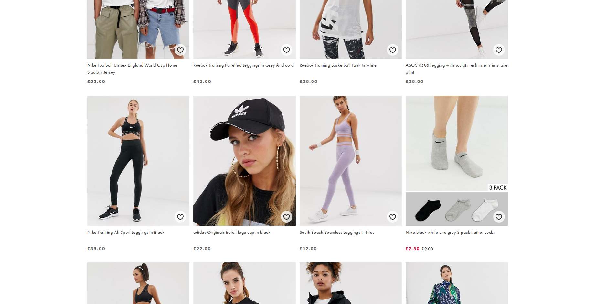

# feruchemy

Help build a labelled set of a dataset to train machine learning models to predict the type of a given web page accurately.

## Usage

Install the extension and when you are on a web page, select the type of the web page from the list of choices. The extension will save the page along with the selected tag in the backend.

There are currently four labels available.

1. Product

    

2. Product Listing

    

3. Article

    

4. Other

    Pages that do not belong to any other categories can be tagged with this label.
